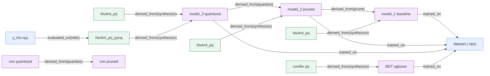

# Dataerai data preservation & provenance for hls4ml

This fork weaves [Dataerai](https://dataerai.com) through the entire hls4ml
tutorial pipeline so that **every artifact is preserved and its lineage is
captured automatically** — the dataset, each model generation (baseline →
pruned → quantized), the CNN and BDT branches, every hls4ml/conifer project, the
FPGA bitstream and the inference outputs become **versioned, citable Dataerai
assets** linked into one **provenance DAG**.

It uses the **existing Dataerai beta APIs only** — no backend or SDK changes. The
integration lives entirely in the [`dataerai_hls4ml/`](dataerai_hls4ml) package and
a single idempotent cell appended to each notebook.



## How it works — four layers (graceful degradation)

| Layer | What | Dataerai API used | Always on? |
|------|------|-------------------|-----------|
| 1 — **Preservation** | each artifact → a versioned asset (+rich metadata: hyperparams, metrics, tool versions, sha256, git sha) | Python SDK `DataEraiClient.upload()` (via the local daemon) | ✅ |
| 2 — **Lineage graph** | typed directed edges (`trained_on`, `derived_from`, `evaluated_on`) between asset UUIDs — the navigable DAG | `POST /api/assets/<id>/relationships/` | ✅ (needs write scope) |
| 3 — **Sealed run** | one hash-chained, signable lineage *run* with an `integrity_root` | `POST /api/lineage/runs/…` | best-effort |
| 4 — **DID citation** | a verifiable `did:dataerai:asset:…` per artifact | `GET /api/identity/resolve/<did>/` | best-effort (DID minting is gated on beta) |

If a layer isn't available (no write scope, DID minting off, no network at all),
the integration degrades cleanly and still records the complete lineage —
locally as `provenance_manifest.json` + `PROVENANCE.md` when offline.

## Setup (one time)

This repo is already a fork. To push provenance to **beta**:

```bash
# 1) Tutorial environment (TensorFlow 2.14, qkeras, hls4ml, conifer, …)
conda env create -f environment.yml
conda activate hls4ml-tutorial

# 2) Dataerai SDK (preservation) + the `dataerai` daemon binary on PATH
pip install -e <path-to>/datatransfer-dataerai/sdk/python
sudo install <path-to>/datatransfer-dataerai/cli/dataerai /usr/local/bin/   # or set DATAERAI_BINARY

# 3) Authenticate against beta and pick an owner project
dataerai auth login --server https://beta.dataerai.com
export DATAERAI_PROJECT_ID=<your-project-uuid>      # GET /api/projects/ to list yours
```

**No credentials? Run fully offline** — the full DAG is recorded locally, nothing
is uploaded:

```bash
export DATAERAI_DRY_RUN=1
```

## Usage

**Option A — just run the notebooks.** Each part ends with one idempotent cell
that calls `dp.capture(notebook="<part>")`. That call routes the notebook's
artifacts into a **per-notebook Dataerai collection** (`hls4ml — <part>`), links
them into the shared lineage DAG, and adds a static **recording** — the notebook
file plus its extracted execution log — to that collection. Run the parts in
order; the graph accumulates. `PROVENANCE.md` / `provenance_manifest.json` are
(re)written each time.

**Option B — capture at the end** (after running notebooks your own way):

```bash
python run_pipeline.py capture --root .
```

**Option C — drive the whole pipeline** (papermill executes notebooks in order
under one lineage run; CPU-feasible parts run, FPGA-synthesis parts are tolerated):

```bash
python run_pipeline.py run --only part1_getting_started
python run_pipeline.py run               # all parts, in order
```

**Prove it with no setup** (synthetic artifacts, offline):

```bash
python run_pipeline.py selftest --dry-run
```

## Python API (used inside the notebook cells)

```python
import dataerai_hls4ml as dp

run = dp.get_run("hls4ml-pipeline", kind="training")   # shared across notebooks
D  = dp.preserve_dataset(["X_train_val.npy", ...], metadata={"source": "openml:hls4ml_lhc_jets_hlf"})
M1 = dp.preserve_keras_model("model_1/KERAS_check_best_model.h5", metadata={"accuracy": acc})
dp.trained_on(M1, D)                                    # model --trained_on--> dataset
H1 = dp.preserve_hls_project("model_1/hls4ml_prj")
dp.add_edge(H1, M1, "derived_from", step="synthesize")
dp.save()                                               # write manifest + report

# …or one call that preserves+links everything present on disk (what the cells use):
dp.capture()
```

Key functions: `enabled()`, `get_run()`, `capture()`, `preserve_dataset()`,
`preserve_keras_model()`, `preserve_hls_project()`, `preserve_array()`,
`preserve_dir()`, `add_edge()`, `trained_on()`, `save()`. See
[`dataerai_hls4ml/`](dataerai_hls4ml) for full docstrings.

## Neural-network training tracking

Every `model.fit(...)` in the tutorial (the MLPs in parts 1/3/4/4.1 and the CNNs in
part 6 — baseline-pruned, quantized-pruned, and AutoQKeras) is tracked with a
Keras callback that logs the training run to Dataerai:

```python
callbacks = list(callbacks) + [dp.keras_callback(
    "Pruned CNN (part6) training", notebook="part6_cnns",
    model_title="Pruned CNN (part6)")]
model_pruned.fit(train_data, epochs=n_epochs, validation_data=val_data, callbacks=callbacks)
```

On each run the callback captures the **hyperparameters** (optimizer, learning
rate, parameter count, wall-clock) and **per-epoch metrics** (loss/accuracy/…),
preserves them as a **training-log** asset in the notebook's collection, preserves
the **trained model** (deduped with the end-of-notebook `capture()`), links
`training-log --derived_from--> model`, and registers the run in Dataerai's
**lineage graph** via the platform's `record_training_run` (Lineage-run API) — the
shipped mechanism for logging a training run (`kind='training'` + a `trained_on`
edge carrying `{params, metrics}`). When the `dataerai[ml]` SDK is installed the
callback calls `record_training_run` directly; otherwise it uses the same lineage
REST endpoints.

> The platform's *neural-attribution* SDK (`TrainingAttributionRecorder`) is
> PyTorch-only and on unmerged feature branches, so it can't instrument this
> Keras/TF tutorial; the Lineage-run training API above is the shipped tooling for
> "track a training run" and is what this callback uses.

## Environment variables

| Var | Default | Meaning |
|---|---|---|
| `DATAERAI_SERVER` | `https://beta.dataerai.com` | backend base URL |
| `DATAERAI_PROJECT_ID` | *(auto-discover first)* | owner project UUID for new assets |
| `DATAERAI_COLLECTION_ID` | — | owner collection UUID (alternative to project) |
| `DATAERAI_DRY_RUN` | `0` | record locally, upload nothing |
| `DATAERAI_PROVENANCE` | `1` | set `0` to make every instrumented cell a no-op |
| `DATAERAI_ACCESS_TOKEN` | *(from CLI keychain/file)* | override the bearer token |
| `DATAERAI_BINARY` | *(`which dataerai`)* | path to the `dataerai` daemon binary |

## Viewing provenance in Dataerai

After a live run, each artifact is an asset under your project; open any asset to
see its **relationships** (the lineage edges) and, where DID minting is enabled,
its **DID document** for citation. The sealed lineage run is retrievable at
`GET /api/lineage/runs/<run_id>/` (its id is printed by each cell and stored in
`provenance_manifest.json`).

## Limitations (honest)

- **FPGA synthesis** (Part 7) needs Xilinx Vitis HLS — unaffected by this layer,
  but those cells only complete where Vitis is installed. Provenance for the HLS
  projects/bitstream is still captured wherever the files exist.
- **DID minting is gated on beta** — Layer 4 citations populate only when minting
  is enabled for your tenant; Layers 1–3 always give full preservation + lineage.
- Provenance writes need a token with write scope; otherwise the lineage is still
  embedded in each asset's metadata and in the local manifest.

## Tests

```bash
pip install pytest
python -m pytest dataerai_hls4ml/tests -q
```
