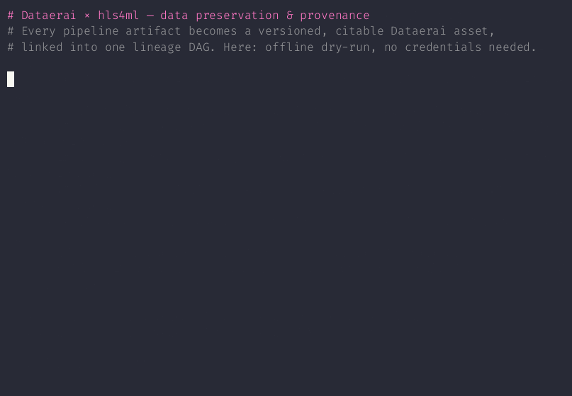
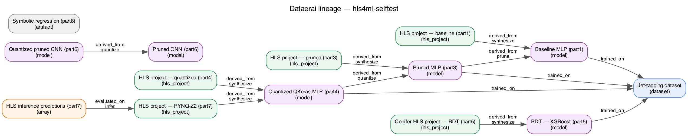

# Demo — Dataerai provenance for the hls4ml pipeline

These artifacts show the integration capturing the **full pipeline lineage**
offline (`--dry-run`, no credentials) — the same flow that runs when you execute
the instrumented notebooks, minus the upload.

## Terminal recording



## Rendered lineage graph

Every `save()` emits `provenance_graph.dot`; rendered here with Graphviz. Nodes
are colour-coded by kind (dataset · model · hls_project · array · artifact) and
edges are the typed lineage relations.



More: [lineage_graph.svg](lineage_graph.svg) ·
[PROVENANCE.sample.md](PROVENANCE.sample.md) (GitHub renders its Mermaid graph inline)

## Reproduce

```bash
python run_pipeline.py selftest --dry-run        # writes provenance_manifest.json + PROVENANCE.md + provenance_graph.dot
dot -Tpng -Gdpi=140 provenance_graph.dot -o lineage_graph.png   # optional: render the DAG
```

Against live beta (`dataerai auth login --server https://beta.dataerai.com` +
`DATAERAI_PROJECT_ID`), the identical flow uploads each artifact as a versioned
asset, creates the lineage edges via the relationships API, opens/closes a sealed
lineage run, and resolves DID citations. See
[../../DATAERAI_PROVENANCE.md](../../DATAERAI_PROVENANCE.md).
